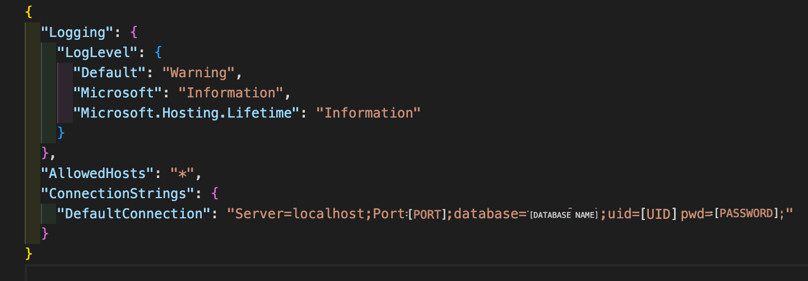

# Vegan Restaurant Api

#### By Mauro Rosales jr

#### enables user to look up/add/edit/delete/rate vegan restaurants in the Portland Metro Area

## Technologies Used

* MySQL/Workbench
* VSCode
* C#
* .Net5
* Swagger
* dotnet

## Description

API for Vegan Restaurants in Portland OR

## Setup/Installation Requirements

* clone repo from https://github.com/maurorosalesjr/LocalLookup.Solution
* create appsettings.json file to allow user to create a SQL database to this project
* Make sure your appsettings.json file looks like this:

* make sure appsettings.json file is on the .gitignore file
* in terminal type : dotnet restore
* in terminal type : dotnet build 
*  if no errors, in terminal type : dotnet ef migrations add Initial
* the previous step will build the database
* in terminal type : dotnet ef database update
* in terminal type : dotnet run
* copy/paste : http://localhost:5003/swagger into browser window
* use links to create and build out database

## Swagger Documentation
Once you've copy and posted http://localhost:5003/swagger into your browser, you can use Swagger to Get, Post, Put and Delete.
Http Request Structure:
* Get: /api/Locals
* Post: /api/Locals
* Get: /api/Locals/{id}
* Put: /api/Locals/{id}
* Delete: /api/Locals/{id}

### Sample query:
http://localhost:5003/api/Locals?cuisine=HotDog

### Sample response

    "localId": 10,
    "name": "Cutie Buys",
    "location": "4138 SE 42nd Ave, Portland OR 97206",
    "cuisine": "HotDog",
    "blerb": "this is a little different, since it is mostly an all vegan grocer, but they do sell and make fresh hotdogs",
    "rating": 9
 

## Known Bugs

* no known bugs

## License

open source

for any questions or comments email me here: mauro.rosales247@gmail.com

Copyright (c) September 2022, Mauro Rosales Jr